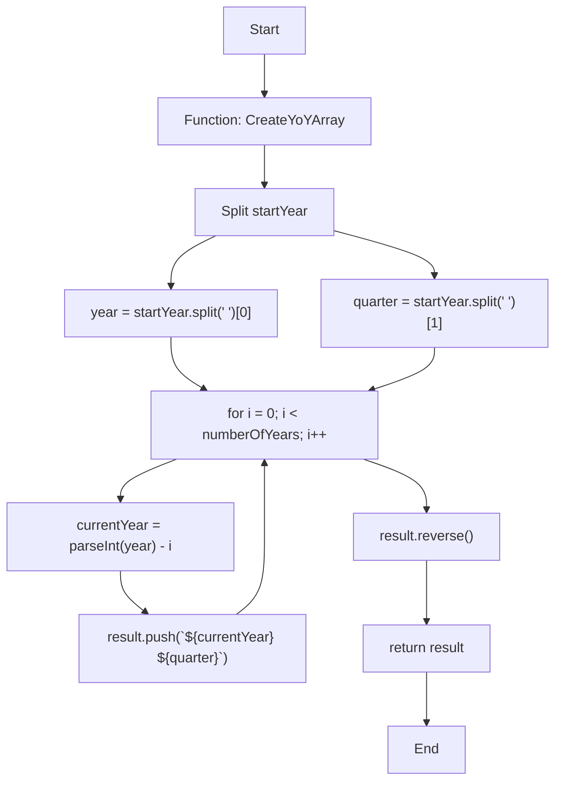
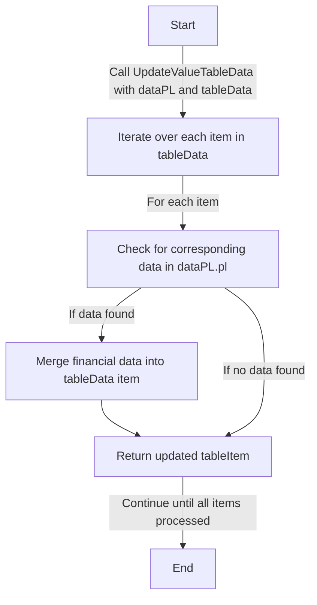

# Documentation of TypeScript Functions

## Function Definition in `financial-statement.service.ts`

### `GetLastQuarterList`

#### Purpose
The purpose of the `GetLastQuarterList` function is to generate a sequence of quarters (3-month periods) in reverse chronological order, starting from a specified year and quarter. This can be particularly useful for financial reporting, data analysis, and any application where tracking periods across multiple years is required.

#### How It Works
The function begins with a start year and quarter, then counts backward through the quarters. If the starting quarter is Q1, it moves to the previous year's Q4 and continues the countdown. This process repeats until the desired number of quarters is generated.

#### Parameters
- `startYear`: string - The starting year and quarter in the format "YYYY QX", for example, "2023 Q3".
- `numberOfQuarter`: number - The number of quarters to generate.

#### Returns
- `string[]`: An array of strings representing quarters in reverse chronological order.

#### Usage Example
```typescript
const resultArray = GetLastQuarterList('2023 Q3', 5);
console.log(resultArray);
// Output: ['2023 Q3', '2023 Q2', '2023 Q1', '2022 Q4', '2022 Q3']
```
#### Flowchart
```mermaid
graph TB
    Start["Start"] --> Input1["Input startYear and numberOfQuarter"]
    Input1 --> CheckInput["Check if yearStr and quarterStr are valid"]
    CheckInput -- "Valid" --> Loop["For each quarter"]
    CheckInput -- "Invalid" --> EndInvalid["Return empty result"]
    Loop --> AddQuarter["Add 'year Qquarter' to result"]
    AddQuarter --> Decrement["Decrement quarter"]
    Decrement -- "quarter > 1" --> Loop
    Decrement -- "quarter == 1" --> ChangeYear["Set quarter to 4, decrement year"]
    ChangeYear --> Loop
    Loop -- "Loop numberOfQuarter times" --> EndValid["Return result"]
    EndInvalid --> End["End"]
    EndValid --> End
``````


### `CreateFinancialItem`

#### Purpose
Creates an object representing a financial item with its values for the past three years.

#### How It Works
- Takes a display name, a corresponding key in the data object, the data object itself, and an array of years.
- Utilizes a helper function to fetch and format financial values from the data object based on the provided key and year indices safely.
- Returns an object with the display name and formatted financial values for each of the last three years.

#### Parameters
- `displayName`: The name to be displayed for the financial item.
- `dataKey`: The key corresponding to the item in the data object.
- `data`: The data object containing financial information in a nested structure.
- `lastYears`: An array containing indices for the last three years.

#### Returns
An object containing the display name of the financial item and its formatted values for the past three years.

#### Sample Usage and Output
```typescript
// Assuming data is an object with financial data and lastYears is [2021, 2022, 2023]
const item = CreateFinancialItem('Revenue', 'Revenue From Operations', data, lastYears);
// Output: { item: 'Revenue', 2: '100.00', 1: '200.00', 0: '300.00' }
``````

#### Flowchart
Below is a simple flow chart for the `CreateFinancialItem` function:

```mermaid
graph TD
    A["Start"] -->|"CreateFinancialItem called"| B["Initialize Parameters"]
    B --> C["Loop through lastYears"]
    C --> D["Call getValue for each year"]
    D --> E{"Check if data exists for year"}
    E -->|"Yes"| F["Format and return value"]
    E -->|"No"| G["Return '0'"]
    F --> H["Create result object"]
    G --> H
    H --> I["Return result object"]
    I --> J["End"]
```


## Function Definition in `income-statement-table.ts`

### `CreateMainTableColumns`

#### Purpose
This function creates table columns for a Tabulator table based on an array of quarters. It formats each column to display financial data with appropriate alignment and formatting, suitable for financial reports or dashboards.

#### How It Works
The function takes an array of quarter strings and generates column definitions for a Tabulator table. The first column is always titled "Items" and configured for textual content. Each subsequent column represents a quarter and is configured for financial data, with right alignment and a money formatter.

#### Parameters
- `quarters`: string[] - An array of quarter strings in the format "YYYY QX".

#### Returns
- `Tabulator.ColumnDefinition[]`: An array of column definitions for Tabulator.

#### Usage Example
```typescript
// Define an array of quarters
const quartersArray = ['2023 Q3', '2023 Q2', '2023 Q1', '2022 Q4', '2022 Q3'];

// Create table columns using the function
const tableColumns = CreateMainTableColumns(quartersArray);

// Initialize a Tabulator table with the generated columns
const table = new Tabulator("#example-table", {
  columns: tableColumns,
  // ... other Tabulator options
});
``````
#### Flowchart
```mermaid
graph TB
    Start["Start"] -->|"Receive quarters array"| A["Create empty columns array"]
    A --> B["Add 'Items' column to array"]
    B --> C["For each quarter in quarters"]
    C -- "Add quarter column" --> D["{title: quarter, field: quarter, headerSort: false}" ]
    D --> E["Add to columns array"]
    E --> F["All quarters processed"]
    F --> End["Return columns array"]
``````


### `CreateYoYArray`

#### Purpose
Generates an array of years and quarters in a year-over-year (YoY) format. This is useful for creating time series data for specific quarters across multiple years.

#### How It Works
- Takes a starting year and quarter (e.g., '2023 Q3') and a number of years.
- Iteratively decrements the year while keeping the quarter constant.
- Constructs an array of these year-quarter combinations.

#### Parameters
- `startYear`: string - The starting year and quarter in the format 'YYYY QX' where YYYY is the year and QX is the quarter (e.g., 'Q3').
- `numberOfYears`: number - The number of years to include in the array, counting backwards from the start year.

#### Returns
- string[] - An array of year-quarter strings in reverse chronological order. For example, if the start year is '2023 Q3' and the number of years is 3, it returns ['2023 Q3', '2022 Q3', '2021 Q3'].

#### Sample Usage and Output
```typescript
let startYear = '2023 Q3';
let numberOfYears = 3;
let yoyArray = CreateYoYArray(startYear, numberOfYears);
console.log(yoyArray); // Outputs: ['2023 Q3', '2022 Q3', '2021 Q3']
```

#### Flowchart


### `UpdateValueMainTableData`

#### Purpose
This function is designed to merge financial data from the dataPL object into each item of the tableData array. It updates each item in tableData with corresponding financial data found in dataPL.pl, keyed by "YYYY QX".

#### How It Works
- The function iterates over each item in the tableData array.
- For each item, it checks for corresponding financial data in dataPL.pl based on the item's name.
- If matching financial data is found, the function merges this data into the tableData item.
- Each key representing a quarter (e.g., "2021 Q1") and its value from dataPL.pl is added to the respective item in tableData.
- The function returns an updated tableData array with merged financial data.

#### Parameters
- `dataPL`: An object containing financial data. It should have a structure where dataPL.pl is an object with keys representing different financial metrics, each containing a sub-object keyed by "YYYY QX".
- `tableData`: An array of objects, each with at least an 'item' property, representing different financial metrics.

#### Returns
- An updated array of tableData where each item contains its original properties plus the corresponding financial data.

#### Sample Usage and Output
```typescript
// Sample input dataPL object
const dataPL = {
  pl: {
    "Revenue From Operations": {
      "2021 Q1": { value: 100000 },
      "2021 Q2": { value: 110000 }
      // ... more quarters
    },
    // ... more items
  }
};

// Sample input tableData array
const tableData = [
  { id: 1, item: "Revenue From Operations" }
  // ... more items
];

// Calling the function
const updatedTableData = UpdateValueTableData(dataPL, tableData);

// Expected output
// [
//   {
//     id: 1,
//     item: "Revenue From Operations",
//     "2021 Q1": 100000,
//     "2021 Q2": 110000
//     // ... more quarters
//   },
//   // ... more items with their respective updated financial data
// ]
````
#### Flowchart

