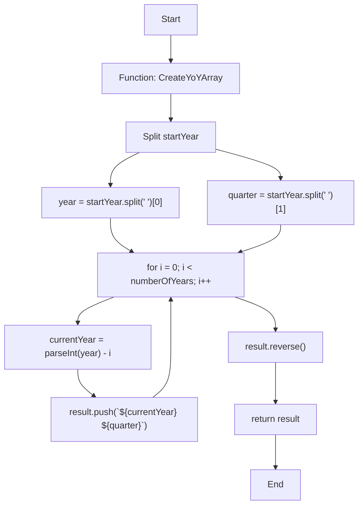
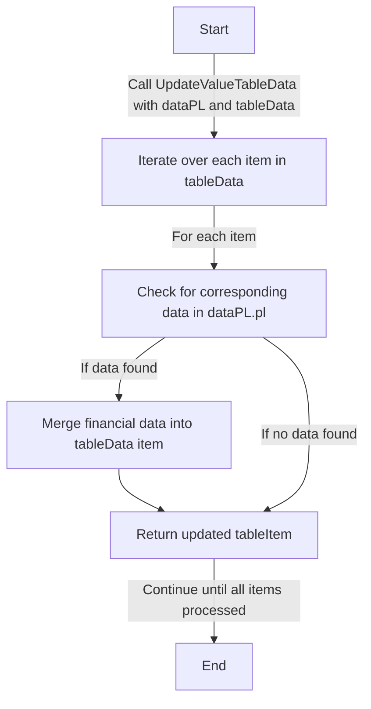
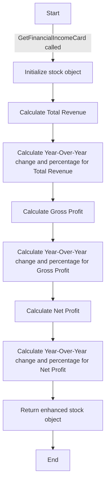

# NgFireball (CheckHoon)

This project was generated with [Angular CLI](https://github.com/angular/angular-cli) version 17.0.5.

## Development server

Run `ng serve` for a dev server. Navigate to `http://localhost:4200/`. The application will automatically reload if you change any of the source files.

## Code scaffolding

Run `ng generate component component-name` to generate a new component. You can also use `ng generate directive|pipe|service|class|guard|interface|enum|module`.

## Build

Run `ng build` to build the project. The build artifacts will be stored in the `dist/` directory.

## Running unit tests

Run `ng test` to execute the unit tests via [Karma](https://karma-runner.github.io).

## Running end-to-end tests

Run `ng e2e` to execute the end-to-end tests via a platform of your choice. To use this command, you need to first add a package that implements end-to-end testing capabilities.

## Further help

To get more help on the Angular CLI use `ng help` or go check out the [Angular CLI Overview and Command Reference](https://angular.io/cli) page.


# Documentation of TypeScript Functions

## Function Definition in `financial-statement.service.ts`

### `GetLastQuarterList`

#### Purpose
The purpose of the `GetLastQuarterList` function is to generate a sequence of quarters (3-month periods) in reverse chronological order, starting from a specified year and quarter. This can be particularly useful for financial reporting, data analysis, and any application where tracking periods across multiple years is required.

#### How It Works
The function begins with a start year and quarter, then counts backward through the quarters. If the starting quarter is Q1, it moves to the previous year's Q4 and continues the countdown. This process repeats until the desired number of quarters is generated.

#### Parameters
- `startYear`: string - The starting year and quarter in the format "YYYY QX", for example, "2023 Q3".
- `numberOfQuarter`: number - The number of quarters to generate.

#### Returns
- `string[]`: An array of strings representing quarters in reverse chronological order.

#### Usage Example
```typescript
const resultArray = GetLastQuarterList('2023 Q3', 5);
console.log(resultArray);
// Output: ['2023 Q3', '2023 Q2', '2023 Q1', '2022 Q4', '2022 Q3']
```
#### Flowchart
```mermaid
graph TB
    Start["Start"] --> Input1["Input startYear and numberOfQuarter"]
    Input1 --> CheckInput["Check if yearStr and quarterStr are valid"]
    CheckInput -- "Valid" --> Loop["For each quarter"]
    CheckInput -- "Invalid" --> EndInvalid["Return empty result"]
    Loop --> AddQuarter["Add 'year Qquarter' to result"]
    AddQuarter --> Decrement["Decrement quarter"]
    Decrement -- "quarter > 1" --> Loop
    Decrement -- "quarter == 1" --> ChangeYear["Set quarter to 4, decrement year"]
    ChangeYear --> Loop
    Loop -- "Loop numberOfQuarter times" --> EndValid["Return result"]
    EndInvalid --> End["End"]
    EndValid --> End
``````


### `CreateFinancialItem`

#### Purpose
Creates an object representing a financial item with its values for the past three years.

#### How It Works
- Takes a display name, a corresponding key in the data object, the data object itself, and an array of years.
- Utilizes a helper function to fetch and format financial values from the data object based on the provided key and year indices safely.
- Returns an object with the display name and formatted financial values for each of the last three years.

#### Parameters
- `displayName`: The name to be displayed for the financial item.
- `dataKey`: The key corresponding to the item in the data object.
- `data`: The data object containing financial information in a nested structure.
- `lastYears`: An array containing indices for the last three years.

#### Returns
An object containing the display name of the financial item and its formatted values for the past three years.

#### Sample Usage and Output
```typescript
// Assuming data is an object with financial data and lastYears is [2021, 2022, 2023]
const item = CreateFinancialItem('Revenue', 'Revenue From Operations', data, lastYears);
// Output: { item: 'Revenue', 2: '100.00', 1: '200.00', 0: '300.00' }
``````

#### Flowchart
Below is a simple flow chart for the `CreateFinancialItem` function:

```mermaid
graph TD
    A["Start"] -->|"CreateFinancialItem called"| B["Initialize Parameters"]
    B --> C["Loop through lastYears"]
    C --> D["Call getValue for each year"]
    D --> E{"Check if data exists for year"}
    E -->|"Yes"| F["Format and return value"]
    E -->|"No"| G["Return '0'"]
    F --> H["Create result object"]
    G --> H
    H --> I["Return result object"]
    I --> J["End"]
```


## Function Definition in `income-statement-table.ts`

### `CreateMainTableColumns`

#### Purpose
This function creates table columns for a Tabulator table based on an array of quarters. It formats each column to display financial data with appropriate alignment and formatting, suitable for financial reports or dashboards.

#### How It Works
The function takes an array of quarter strings and generates column definitions for a Tabulator table. The first column is always titled "Items" and configured for textual content. Each subsequent column represents a quarter and is configured for financial data, with right alignment and a money formatter.

#### Parameters
- `quarters`: string[] - An array of quarter strings in the format "YYYY QX".

#### Returns
- `Tabulator.ColumnDefinition[]`: An array of column definitions for Tabulator.

#### Usage Example
```typescript
// Define an array of quarters
const quartersArray = ['2023 Q3', '2023 Q2', '2023 Q1', '2022 Q4', '2022 Q3'];

// Create table columns using the function
const tableColumns = CreateMainTableColumns(quartersArray);

// Initialize a Tabulator table with the generated columns
const table = new Tabulator("#example-table", {
  columns: tableColumns,
  // ... other Tabulator options
});
``````
#### Flowchart
```mermaid
graph TB
    Start["Start"] -->|"Receive quarters array"| A["Create empty columns array"]
    A --> B["Add 'Items' column to array"]
    B --> C["For each quarter in quarters"]
    C -- "Add quarter column" --> D["{title: quarter, field: quarter, headerSort: false}" ]
    D --> E["Add to columns array"]
    E --> F["All quarters processed"]
    F --> End["Return columns array"]
``````


### `CreateYoYArray`

#### Purpose
Generates an array of years and quarters in a year-over-year (YoY) format. This is useful for creating time series data for specific quarters across multiple years.

#### How It Works
- Takes a starting year and quarter (e.g., '2023 Q3') and a number of years.
- Iteratively decrements the year while keeping the quarter constant.
- Constructs an array of these year-quarter combinations.

#### Parameters
- `startYear`: string - The starting year and quarter in the format 'YYYY QX' where YYYY is the year and QX is the quarter (e.g., 'Q3').
- `numberOfYears`: number - The number of years to include in the array, counting backwards from the start year.

#### Returns
- string[] - An array of year-quarter strings in reverse chronological order. For example, if the start year is '2023 Q3' and the number of years is 3, it returns ['2023 Q3', '2022 Q3', '2021 Q3'].

#### Sample Usage and Output
```typescript
let startYear = '2023 Q3';
let numberOfYears = 3;
let yoyArray = CreateYoYArray(startYear, numberOfYears);
console.log(yoyArray); // Outputs: ['2023 Q3', '2022 Q3', '2021 Q3']
```

#### Flowchart


### `UpdateValueMainTableData`

#### Purpose
This function is designed to merge financial data from the dataPL object into each item of the tableData array. It updates each item in tableData with corresponding financial data found in dataPL.pl, keyed by "YYYY QX".

#### How It Works
- The function iterates over each item in the tableData array.
- For each item, it checks for corresponding financial data in dataPL.pl based on the item's name.
- If matching financial data is found, the function merges this data into the tableData item.
- Each key representing a quarter (e.g., "2021 Q1") and its value from dataPL.pl is added to the respective item in tableData.
- The function returns an updated tableData array with merged financial data.

#### Parameters
- `dataPL`: An object containing financial data. It should have a structure where dataPL.pl is an object with keys representing different financial metrics, each containing a sub-object keyed by "YYYY QX".
- `tableData`: An array of objects, each with at least an 'item' property, representing different financial metrics.

#### Returns
- An updated array of tableData where each item contains its original properties plus the corresponding financial data.

#### Sample Usage and Output
```typescript
// Sample input dataPL object
const dataPL = {
  pl: {
    "Revenue From Operations": {
      "2021 Q1": { value: 100000 },
      "2021 Q2": { value: 110000 }
      // ... more quarters
    },
    // ... more items
  }
};

// Sample input tableData array
const tableData = [
  { id: 1, item: "Revenue From Operations" }
  // ... more items
];

// Calling the function
const updatedTableData = UpdateValueTableData(dataPL, tableData);

// Expected output
// [
//   {
//     id: 1,
//     item: "Revenue From Operations",
//     "2021 Q1": 100000,
//     "2021 Q2": 110000
//     // ... more quarters
//   },
//   // ... more items with their respective updated financial data
// ]
````
#### Flowchart

## Function Definition in `financial-statement-card.ts`
### `GetLastYear`

#### Purpose
Retrieves the quarter from one year prior to the current period from the stock's financial data.

#### How It Works
- Calls the `GetLastQuarterList` function from the `FinancialService` instance.
- The `GetLastQuarterList` function is passed the current period and the number of quarters to generate, which is 5 in this case.
- It then selects the 5th element from the returned array, which corresponds to the same quarter from the previous year.

#### Parameters
- `stock`: any - The stock object containing the financial period data.

#### Returns
- `string`: A string representing the year and quarter in the format "YYYY QX".

#### Sample Usage and Output
```typescript
const stock = { period: '2023 Q3' };
const lastYearQuarter = GetLastYear(stock);
// Assuming the financialService.GetLastQuarterList method returns an array of the last five quarters,
// the output would be '2022 Q3'.
````
### `GetStockSector`

#### Purpose
Retrieves the sector classification of a given stock.

#### How It Works
- Directly accesses and returns the `sector` property from the provided stock object.

#### Parameters
- `stock`: any - The stock object containing sector information.

#### Returns
- `string`: The sector of the stock.

#### Sample Usage and Output
```typescript
const stock = { sector: 'Banking' };
const sector = GetStockSector(stock);
// Output: 'Banking'
```

### `GetTotalRevenue`

#### Purpose
Calculates and retrieves the total revenue for a given stock, based on its sector. It distinguishes between different types of revenue (e.g., 'Interest Income' for banking sector stocks).

#### How It Works
- The function first determines the stock's sector using the `GetStockSector` function.
- If the stock is in the 'Banking' sector, it sets the `totalRevenueItemName` to 'Interest Income' and retrieves the corresponding value from the stock's financial data (`pl` object).
- For stocks in other sectors, it sets `totalRevenueItemName` to 'Total Income' and retrieves the 'Total Revenue' value from the stock's financial data.
- The retrieved value is then returned as the total revenue for the stock.

#### Parameters
- `stock`: any - The stock object containing financial data and sector information.

#### Returns
- `any`: The total revenue figure for the stock, which varies based on the sector.

#### Sample Usage and Output
```typescript
const stock = {
  sector: 'Banking',
  period: '2023 Q1',
  pl: {
    'Interest Income': {
      '2023 Q1': { value: '50000' }
    },
    'Total Revenue': {
      '2023 Q1': { value: '100000' }
    }
  }
};
const totalRevenue = GetTotalRevenue(stock);
// Output: '50000' if the sector is 'Banking', or '100000' for other sectors.
```

### `GetTotalRevenueLastYear`

#### Purpose
Determines the total revenue for a stock in the last financial year. This function accounts for sector-specific revenue calculations, particularly distinguishing between 'Banking' and other sectors.

#### How It Works
- The function first identifies the stock's sector using the `GetStockSector` function.
- For stocks in the 'Banking' sector, it accesses the 'Interest Income' value for the last year's quarter, as obtained by the `GetLastYear` function.
- For stocks in other sectors, it fetches the 'Total Revenue' for the last year's quarter.
- This approach ensures that the total revenue figure is accurately retrieved according to the sector-specific financial structure.

#### Parameters
- `stock`: any - The stock object containing financial data including sector and profit & loss (pl) details.

#### Returns
- `any`: The total revenue for the stock for the last financial year.

#### Sample Usage and Output
```typescript
const stock = {
  sector: 'Banking',
  pl: {
    'Interest Income': {
      '2022 Q4': { value: '45000' },
      '2021 Q4': { value: '40000' }
    },
    'Total Revenue': {
      '2022 Q4': { value: '90000' },
      '2021 Q4': { value: '85000' }
    }
  },
  period: '2023 Q1'
};
const totalRevenueLastYear = GetTotalRevenueLastYear(stock);
// Output: '40000' if the sector is 'Banking', or '85000' for other sectors.
```

### `GetTotalRevenueYoY`

#### Purpose
Calculates the Year-Over-Year (YoY) change in total revenue for a given stock.

#### How It Works
- Subtracts the total revenue of the last financial year (`totalRevenueLastYear`) from the total revenue of the current period (`totalRevenue`) to determine the Year-Over-Year change.

#### Parameters
- `stock`: any - The stock object containing the total revenue for the current period and the last year.

#### Returns
- `any`: The Year-Over-Year change in total revenue.

#### Sample Usage and Output
```typescript
const stock = {
  totalRevenue: 120000,
  totalRevenueLastYear: 100000
};
const totalRevenueYoY = GetTotalRevenueYoY(stock);
// Output: 20000 (representing the YoY change in total revenue)
```

### `GetTotalRevenusYoYPercent`

#### Purpose
Calculates the Year-Over-Year (YoY) percentage change in total revenue for a given stock.

#### How It Works
- Computes the Year-Over-Year change in total revenue as a ratio of the total revenue from the last financial year.
- The ratio is then multiplied by 100 to convert it into a percentage. This calculation takes the absolute value of the last year's total revenue to ensure a correct percentage calculation even if the last year's revenue was negative.

#### Parameters
- `stock`: any - The stock object containing the total revenue change Year-Over-Year (`totalRevenusYoY`) and the total revenue from the last year (`totalRevenueLastYear`).

#### Returns
- `any`: The Year-Over-Year percentage change in total revenue.

#### Sample Usage and Output
```typescript
const stock = {
  totalRevenusYoY: 20000, // Change in revenue
  totalRevenueLastYear: 100000 // Last year's revenue
};
const totalRevenusYoYPercent = GetTotalRevenusYoYPercent(stock);
// Output: 20 (representing a 20% Year-Over-Year change in total revenue)
```

### `GetGrossProfit`

#### Purpose
Calculates the gross profit for a given stock. This function adapts to different sectors, specifically accounting for unique financial metrics in the 'Banking' and 'Finance and Securities' sectors.

#### How It Works
- The function first determines the sector of the stock using `GetStockSector`.
- For stocks in the 'Banking' sector, it sets `grossProfitItemName` to 'Net Interest Income' and retrieves the corresponding value.
- For stocks in the 'Finance and Securities' sector, `grossProfitItemName` is set to 'EBIT', and the relevant value is fetched.
- For other sectors, the gross profit is calculated as the difference between 'Revenue From Operations' and 'Costs'.
- The function dynamically selects the appropriate financial metrics based on the stock's sector and calculates the gross profit accordingly.

#### Parameters
- `stock`: any - The stock object containing financial data including sector, profit & loss (pl) details, and period.

#### Returns
- `any`: The gross profit for the stock, which varies based on the sector.

#### Sample Usage and Output
```typescript
const stock = {
  sector: 'Banking',
  period: '2023 Q1',
  pl: {
    'Net Interest Income': { '2023 Q1': { value: '50000' } },
    'Profit (Loss) Before Finance Costs And Income Tax Expense': { '2023 Q1': { value: '30000' } },
    'Revenue From Operations': { '2023 Q1': { value: '100000' } },
    'Costs': { '2023 Q1': { value: '40000' } }
  }
};
const grossProfit = GetGrossProfit(stock);
// Output: '50000' for Banking sector, '30000' for Finance and Securities, or '60000' (Revenue From Operations - Costs) for other sectors.
```

### `GetGrossProfitLastYear`

#### Purpose
Calculates the gross profit for a stock in the last financial year, adapting to different financial metrics based on the stock's sector.

#### How It Works
- The function determines the sector of the stock using `GetStockSector`.
- For stocks in the 'Banking' sector, it retrieves the 'Net Interest Income' value for the last year's quarter, as determined by the `GetLastYear` function.
- For stocks in the 'Finance and Securities' sector, it fetches the 'Profit (Loss) Before Finance Costs And Income Tax Expense' value for the last year.
- For other sectors, the gross profit is calculated as the difference between 'Revenue From Operations' and 'Costs' for the last year's quarter.
- This method ensures that the gross profit is accurately calculated based on the sector-specific financial structure of the stock.

#### Parameters
- `stock`: any - The stock object containing financial data including sector and profit & loss (pl) details.

#### Returns
- `any`: The gross profit for the stock for the last financial year.

#### Sample Usage and Output
```typescript
const stock = {
  sector: 'Banking',
  pl: {
    'Net Interest Income': { '2022 Q4': { value: '45000' } },
    'Profit (Loss) Before Finance Costs And Income Tax Expense': { '2022 Q4': { value: '30000' } },
    'Revenue From Operations': { '2022 Q4': { value: '80000' } },
    'Costs': { '2022 Q4': { value: '30000' } }
  },
  period: '2023 Q1'
};
const grossProfitLastYear = GetGrossProfitLastYear(stock);
// Output: '45000' for Banking sector, '30000' for Finance and Securities, or '50000' (Revenue From Operations - Costs) for other sectors.
```
### `GetGrossProfitYoY`

#### Purpose
Calculates the Year-Over-Year (YoY) change in gross profit for a given stock.

#### How It Works
- This function computes the difference in gross profit between the current year (`gp`) and the last year (`gpLastYear`).
- It simply subtracts the gross profit of the last year from the gross profit of the current year to find the Year-Over-Year change.

#### Parameters
- `stock`: any - The stock object containing gross profit data for the current year (`gp`) and the last year (`gpLastYear`).

#### Returns
- `any`: The Year-Over-Year change in gross profit.

#### Sample Usage and Output
```typescript
const stock = {
  gp: 120000, // Gross profit for the current year
  gpLastYear: 100000 // Gross profit for the last year
};
const grossProfitYoY = GetGrossProfitYoY(stock);
// Output: 20000 (representing the YoY change in gross profit)
```

### `GetGrossProfitYoYPercent`

#### Purpose
Calculates the Year-Over-Year (YoY) percentage change in gross profit for a given stock.

#### How It Works
- The function computes the Year-Over-Year change in gross profit as a percentage.
- It divides the Year-Over-Year gross profit change (`gpYoY`) by the absolute value of last year's gross profit (`gpLastYear`) to get a ratio.
- This ratio is then multiplied by 100 to convert it into a percentage. Using the absolute value ensures accurate calculation even if last year's gross profit was negative.

#### Parameters
- `stock`: any - The stock object containing the Year-Over-Year gross profit change (`gpYoY`) and last year's gross profit (`gpLastYear`).

#### Returns
- `any`: The Year-Over-Year percentage change in gross profit.

#### Sample Usage and Output
```typescript
const stock = {
  gpYoY: 20000, // Year-Over-Year change in gross profit
  gpLastYear: 100000 // Gross profit for the last year
};
const grossProfitYoYPercent = GetGrossProfitYoYPercent(stock);
// Output: 20 (representing a 20% Year-Over-Year change in gross profit)
```

### `GetNetProfit`

#### Purpose
Retrieves the net profit for a given stock for the current financial period.

#### How It Works
- The function sets `netProfitItemName` to 'Net Profit' as an identifier for the type of profit being calculated.
- It then accesses the stock's profit and loss (pl) data to retrieve the 'Net Profit (Loss) For The Period' value for the specified financial period.
- The net profit value for the current period is extracted and returned.

#### Parameters
- `stock`: any - The stock object containing profit and loss data (`pl`) and the current financial period (`period`).

#### Returns
- `any`: The net profit value for the stock for the current financial period.

#### Sample Usage and Output
```typescript
const stock = {
  period: '2023 Q1',
  pl: {
    'Net Profit (Loss) For The Period': {
      '2023 Q1': { value: '75000' }
    }
  }
};
const netProfit = GetNetProfit(stock);
// Output: '75000' (the net profit for the period '2023 Q1')
```
### `GetNetProfitLastYear`

#### Purpose
Calculates the net profit (or loss) for a stock in the previous financial year. This function is designed to retrieve the net profit or loss value from the stock's financial data for the last year's period.

#### How It Works
- Utilizes the `GetLastYear` function to determine the financial period for the previous year.
- Retrieves the 'Net Profit (Loss) For The Period' value for that specific period from the stock's financial data (`pl` object).

#### Parameters
- `stock`: any - The stock object containing detailed profit & loss (pl) data and the current financial period.

#### Returns
- `any`: The net profit (or loss) for the stock for the last financial year.

#### Sample Usage and Output
```typescript
const stock = {
  pl: {
    'Net Profit (Loss) For The Period': {
      '2022 Q4': { value: '20000' },
      '2021 Q4': { value: '-5000' }
    }
  },
  period: '2023 Q1'
};
const netProfitLastYear = GetNetProfitLastYear(stock);
// Output: '20000' if the last year's quarter was '2022 Q4', or '-5000' for '2021 Q4'.
```

### `GetNetProfitYoY`

#### Purpose
Calculates the Year-Over-Year (YoY) change in net profit for a given stock. This function is aimed at assessing the growth or decline in a stock's profitability over the past year.

#### How It Works
- Subtracts the net profit from the last financial year (`npLastYear`) from the current financial year's net profit (`np`) to calculate the Year-Over-Year change.
- This calculation provides a straightforward assessment of how the net profit has evolved from one year to the next.

#### Parameters
- `stock`: any - The stock object containing the net profit data for the current period (`np`) and the last year (`npLastYear`).

#### Returns
- `any`: The Year-Over-Year change in net profit.

#### Sample Usage and Output
```typescript
const stock = {
  np: 30000, // Net profit for the current period
  npLastYear: 25000 // Net profit for the last year
};
const netProfitYoY = GetNetProfitYoY(stock);
// Output: 5000 (indicating a 5000 increase in net profit Year-Over-Year)
```

### `GetNetProfitYoYPercent`

#### Purpose
Calculates the Year-Over-Year (YoY) percentage change in net profit for a given stock. This function provides a percentage-based assessment of the growth or decline in the stock's net profitability over the past year.

#### How It Works
- Divides the Year-Over-Year change in net profit (`npYoY`) by the absolute value of last year's net profit (`npLastYear`). This approach ensures accurate percentage calculations, even when last year's net profit was negative.
- The result is then multiplied by 100 to convert it into a percentage, representing the rate of change in net profit compared to the previous year.

#### Parameters
- `stock`: any - The stock object containing the net profit data for the Year-Over-Year change (`npYoY`) and last year (`npLastYear`).

#### Returns
- `any`: The Year-Over-Year percentage change in net profit.

#### Sample Usage and Output
```typescript
const stock = {
  npYoY: 5000, // Year-Over-Year change in net profit
  npLastYear: 25000 // Net profit for the last year
};
const netProfitYoYPercent = GetNetProfitYoYPercent(stock);
// Output: 20 (representing a 20% increase in net profit Year-Over-Year)
```

### `GetFinancialIncomeCard`

#### Purpose
Consolidates various financial metrics into a single enhanced stock object, representing a comprehensive financial income card. This function aggregates key metrics such as total revenue, gross profit, and net profit, along with their Year-Over-Year changes and percentages.

#### How It Works
- The function calculates and sets various financial metrics on the stock object:
  - Total Revenue for the current period and the last year.
  - Year-Over-Year change and percentage change in Total Revenue.
  - Gross Profit for the current period and the last year.
  - Year-Over-Year change and percentage change in Gross Profit.
  - Net Profit for the current period and the last year.
  - Year-Over-Year change and percentage change in Net Profit.
- Each of these metrics is computed using the respective functions (`GetTotalRevenue`, `GetGrossProfit`, `GetNetProfit`, etc.).
- The updated stock object, with all these financial metrics, is then returned.

#### Parameters
- `stock`: any - The stock object to be enhanced with financial metrics.

#### Returns
- `string`: The enhanced stock object containing all calculated financial metrics.

#### Sample Usage and Output
```typescript
const stock = {
  // ... initial stock data including financial data ...
};
const financialIncomeCard = GetFinancialIncomeCard(stock);
// Output: The stock object now contains properties like totalRevenue, totalRevenueLastYear,
// totalRevenusYoY, gp, gpLastYear, np, npLastYear, and respective YoY changes and percentages.
```
#### Flowchart

