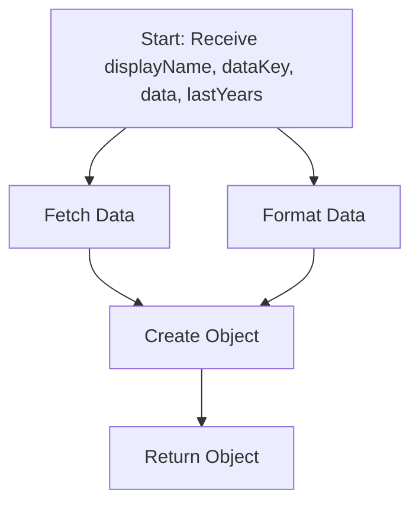

# Documentation of TypeScript Functions

## Function Definition in `income-statement-table.ts`

### `CreateFinancialItem`

#### Purpose
Creates an object representing a financial item with its values for the past three years.

#### Flowchart
Below is a simple flow chart for the `CreateFinancialItem` function:



#### How It Works
- Takes a display name, a corresponding key in the data object, the data object itself, and an array of years.
- Fetches the financial values from the data object based on the provided key and year indices.
- Returns an object with the display name and financial values for each of the last three years.

#### Parameters
- `displayName`: The name to be displayed for the financial item.
- `dataKey`: The key corresponding to the item in the data object.
- `data`: The data object containing financial information.
- `lastYears`: An array containing indices for the last three years.

#### Returns
An object containing the display name of the financial item and its values for the past three years.

#### Sample Usage and Output
```typescript
// Assuming data is an object with financial data and lastYears is [2021, 2022, 2023]
const item = CreateFinancialItem('Revenue', 'Revenue From Operations', data, lastYears);
// Output: { item: 'Revenue', 2: '100.00', 1: '200.00', 0: '300.00' }

